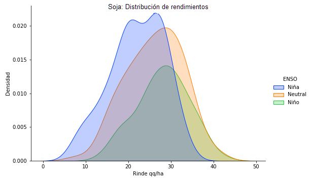
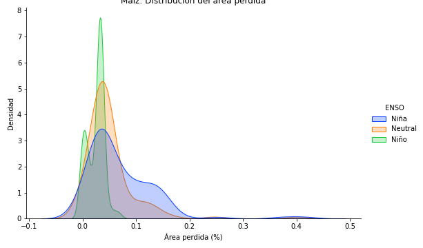

# Efecto Sequía sobre la producción

En la actualidad, la campaña de gruesa 2021/2022 se encuentra en pleno desarrollo y esta sufriendo la falta de humedad en varias de las principales zonas productivas de Argentina. Por segundo año consecutivo se produce el fenómeno climático de La Niña generando un aumento en el riesgo de que parte de la cosecha gruesa se vea fuertemente afectada, en especial la siembra temprana, ya que en el actual período estos cultivos se encuentran en la etapa del llenado de los granos.

Con el objetivo de clasificar los años de escasez hídrica en la zona productiva y pronosticar un escenario de sequía, se utiliza como referencia el Índice Multivariado ENSO elaborado por el [Australian Bureau of Meteorology]("https://psl.noaa.gov/enso/mei/data/meiv2.data"). Para enero y marzo el Bureau of Meteorology del gobierno australiano proyecta un Índice Multivariado ENSO (MEI) de -1,1 y -0,6, respectivamente. Ellos indican que valores por encima del 0,5 se consideran como el fenómeno meteorológico el niño, inferiores a -0,5 cómo la niña y los valores en el medio cómo neutral. Al realizar el promedio entre ambos y compararlo con los MEI de enero-febrero en años previos, se observa que estamos en valores inferiores a -0,5, e incluso, similares al año pasado.

Para determinar los distintos escenarios de sequía y sus consecuencias sobre el rinde en Argentina, se cruzaron los datos históricos de rinde del [PAS de la Bolsa de Cereales]("https://www.bolsadecereales.com/download/informes/documento2/121") con indicadores climáticos, considerando especialmente los meses críticos para los cultivos de maíz temprano y soja de primera. En función a ello se evaluó para cada zona PAS el rendimiento histórico y el porcentaje de área perdida bajo escenarios de año niña, neutral y niño.  

¿Por qué es interesante esto? Como se puede ver abajo las campañas que se encuentran atravesadas por **la niña** presentan una distribución de rendimientos más baja (curva corrida a la izquierda) que en años neutrales o niños. Mientras que, en el caso del porcentaje del área perdida se observa lo contrario, una cola derecha más pesada (mayor porcentaje de pérdida) en los años niña. Lo mismo se observa si vemos los gráficos del maíz.

Seleccionando únicamente las campañas afectadas por la niña, se calculó el rinde y el porcentaje de área perdida mínima, máxima y media por cada zona PAS. Luego, a las estimaciones de área sembrada 2021/22 se les aplicaron los resultados obtenidos para llegar a la producción de los distintos escenarios teniendo en cuenta las siguientes definiciones:

- **escenario leve**: mejor rendimiento y mínima área perdida aplicados al área del maíz y soja.

- **escenario moderado**: rendimiento medio y área perdida media aplicados al área del maíz y soja.

- **escenario severo**: mínimo rinde y máxima área perdida aplicados al área del maíz y soja. 

Escenarios de producción en millones de toneladas:
Cultivo  | Leve | Moderado | Severo | 
------------- | ------------- | ------------- | ------------- |
Maíz  | 57.64  | 43.67 | 29.76 |
Soja  | 48.46   | 37.62   | 24.20 |